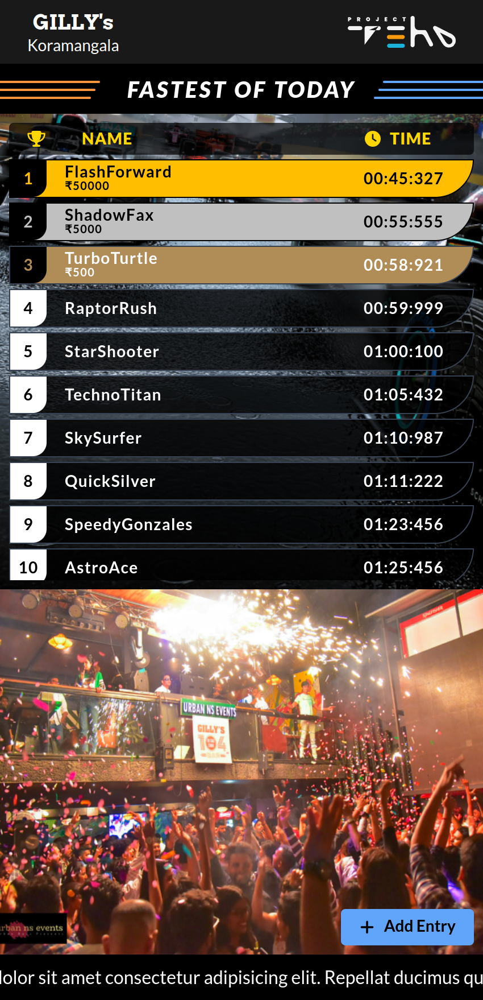

# LazyIdli Assignment



## Features

1. The application seamlessly adapts to different screen sizes.
2. TypeScript used for defining the structure of leaderboard entries and ensuring type-safe prop usage in React components.
3. Redux Toolkit used for managing the leaderboard data.
4. ESLint is integrated into the project to enforce coding style guidelines, ensuring clean, consistent, and less error-prone code.

## Technologies Used

- **Front-End Framework:** React
- **State Management:** Redux Toolkit
- **Styling:** Tailwind CSS
- **Development Tools:**
  - Vite
  - TypeScript

## Installation and Development

1. **Clone the Repository:**

   ```bash
   git clone https://github.com/Terminal239/lazy-idli-assignment.git
   ```

2. **Navigate to the Project Directory:**

   ```bash
   cd lazy-idli-assignment
   ```

3. **Install Dependencies:**

   ```bash
   npm install
   ```

4. **Start the Development Server:**
   ```bash
   npm run dev
   ```

This will launch the development server, usually accessible at `http://localhost:5173/` in your web browser.
